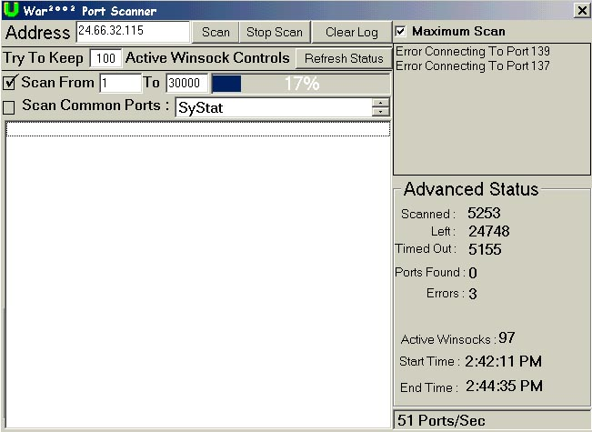



## Really Really Fast Port Scanner\!

### Description

This Code Will Scan All The Ports From 1 to Whatever Port You Choose, or you can set it to scan on the more common ports like pop3, telnet, http, SubSeven, NetBus and more.. Please download this and vote high for me!
 
### More Info
 

             |
---                |---
**Submitted On**   |2001-03-25 15:14:10
**By**             |[James Gourley](https://github.com/Planet-Source-Code/PSCIndex/blob/master/ByAuthor/james-gourley.md)
**Level**          |Intermediate
**User Rating**    |4.0 (8 globes from 2 users)
**Compatibility**  |VB 6\.0
**Category**       |[Internet/ HTML](https://github.com/Planet-Source-Code/PSCIndex/blob/master/ByCategory/internet-html__1-34.md)
**World**          |[Visual Basic](https://github.com/Planet-Source-Code/PSCIndex/blob/master/ByWorld/visual-basic.md)
**Archive File**   |[CODE\_UPLOAD175533252001\.zip](https://github.com/Planet-Source-Code/james-gourley-really-really-fast-port-scanner__1-21924/archive/master.zip)

